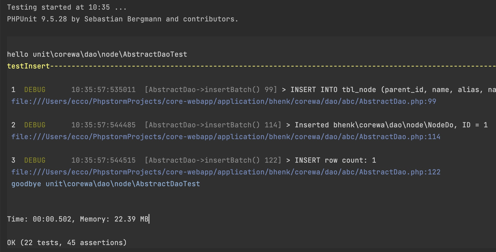
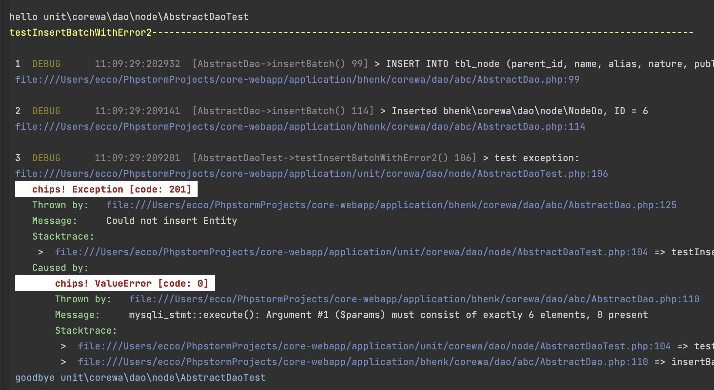

[](https://bhenklogger.readthedocs.io/en/latest/?badge=latest)

# logger-d
Logging facility.

Logger is written in PHP \
Requirement: php >=8.1 \
Documentation: http://bhenklogger.readthedocs.io/

## Logging
Logger enables invoking log statements with static methods:
```
 Log::debug("Your message");
```
Log statements will be printed to a logfile. Statements
above a certain level will be printed to an error logfile.

## Logging while testing
Up to this far nothing new under the sun. Comes PHPUnit testing.
While it invites you to write testable code, there
will always be more or less obscure places in your code. Does the program flow take the expected junction
at an *if* statement? Has this or that variable the right value at a precise moment? You can put in *debug* statements
for your logger at those places, but chances are you drown in log statements by the time your code base has grown
sufficiently large. Wouldn't it be great to see exactly those log statements on your console,
of that part of your codebase that is under test, with the chosen severity level? A Trait and an Attribute in
the package *bhenk\logger\unit* allows you to precisely do that, without
touching the code under test. Trait and Attribute are applied on
the TestCase and/or test method.

Here are screenshots of the output to console of normal log messages, that would otherwise be drowned in a
mess of statements in your logfiles.



Note that of the 22 tests only the chosen TestCase(s) and/or
test method(s) is outputting log statements of the code under
test to  console.



Inspect that error messages are clear and understandable while
writing test driven code.

## Installing

```
  composer require bhenk/logger
```

Happy coding!